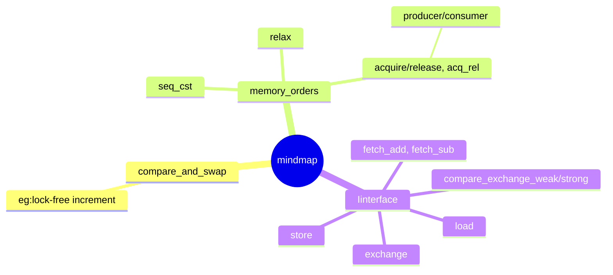

在 C++ 多线程编程中，`std::atomic` 是实现**无锁编程（Lock-free Programming）**的核心工具。它提供了一种原子化的操作方式，确保多线程访问同一变量时不会出现数据竞态（Data Race），而无需使用重量级的互斥锁（mutex）。

---knowledge map:



## 1. 核心原理

`std::atomic` 的底层原理主要依赖于两个层面：**硬件指令支持**和**内存模型（Memory Model）**。

### 硬件层面：CAS 指令

现代 CPU 提供了原子化的指令，最著名的是 **CAS (Compare-and-Swap)**。

* **过程**：比较内存中的值是否等于预期值，如果相等，则将其更新为新值。
* **特性**：这个过程由硬件保证不可分割，要么成功，要么失败，不会被中途抢占。

### 软件层面：内存顺序 (Memory Ordering)

原子操作不仅关注“原子性”，还关注“顺序性”。由于编译器优化和 CPU 乱序执行，代码的执行顺序可能与书写顺序不同。`std::atomic` 通过内存屏障（Memory Barriers）来约束这种乱序。

---

## 2. 基本用法

要使用原子变量，需要包含头文件 `<atomic>`。

### 定义与初始化

```cpp
#include <atomic>

std::atomic<int> count(0); 
// 或者
std::atomic<bool> flag{false};

```

### 核心操作函数

`std::atomic` 禁用了拷贝构造函数和赋值运算符，必须使用提供的成员函数：

| 操作 | 函数 | 说明 |
| --- | --- | --- |
| **读** | `load()` | 原子地读取值 |
| **写** | `store(val)` | 原子地存入值 |
| **交换** | `exchange(val)` | 存入新值并返回旧值 |
| **比较交换** | `compare_exchange_strong/weak` | 只有当当前值等于预期值时才更新 |
| **运算** | `fetch_add`, `fetch_sub` | 原子加减，返回旧值（仅限整型/指针） |

---

## 3. 深入理解 CAS (Compare-Exchange)

这是原子变量最强大也最复杂的用法，通常用于实现无锁队列或栈。

```cpp
std::atomic<int> value{10};
int expected = 10;
int desired = 20;

// 如果 value == expected，则 value = desired，返回 true
// 如果 value != expected，则 expected = value (更新预期值)，返回 false
bool success = value.compare_exchange_strong(expected, desired);

```

* **`strong` vs `weak**`：
* `strong`：保证行为可靠，但性能稍低。
* `weak`：在某些架构（如 ARM）上可能会由于“伪失败”返回 false，通常需要放在循环中使用，但性能更高。


---

## 4. 内存顺序 (std::memory_order)

这是 `std::atomic` 的精髓，决定了非原子操作在原子操作前后的可见性。

1. **`memory_order_relaxed`**：仅保证操作本身是原子的，不保证前后代码的执行顺序（性能最高）。
2. **`memory_order_acquire` / `release**`：
* **Release**：确保在此操作之前的读写指令不会被重排到此操作之后。
* **Acquire**：确保在此操作之后的读写指令不会被重排到此操作之前。
* 常用于“生产者-消费者”模型。


3. **`memory_order_seq_cst`**（默认值）：顺序一致性。最严格，所有线程看到的执行顺序完全一致，但性能损耗最大。

---

## 5. 为什么要用 atomic 而不是 mutex？

| 特性 | std::mutex | std::atomic |
| --- | --- | --- |
| **开销** | 高（涉及内核态切换、线程挂起） | 低（通常是单条 CPU 指令） |
| **死锁风险** | 存在 | 无 |
| **粒度** | 大（保护整个代码块） | 小（保护单个变量） |
| **编程复杂度** | 较低 | 较高（需考虑内存模型） |

---

## 6. 使用建议

1. **默认使用 `seq_cst**`：除非你对性能有极其苛刻的要求，且对底层内存模型了如指掌，否则不要轻易修改 `memory_order` 参数。
2. **检查是否为真正的无锁**：并不是所有类型的 `std::atomic<T>` 都是无锁的。可以使用 `is_lock_free()` 成员函数来检查。如果类型太大，编译器内部可能还是会用锁。
3. **避免 ABA 问题**：在复杂的无锁结构（如链表）中，仅仅靠 CAS 可能会遇到 ABA 问题，通常需要配合版本号或 `std::atomic<std::shared_ptr<T>>` (C++20) 来解决。


# CAS and Memory Order 

---

## 1. Compare-And-Swap (CAS) 的经典例子：无锁计数器

CAS 最常见的用途是实现**自旋重试机制**。假设我们要实现一个简单的 `increment` 函数，但不用 `fetch_add`（因为它内部已经封装好了），而是手动用 CAS 来确保安全。

### 代码实现

```cpp
#include <atomic>
#include <iostream>

class NonBlockingCounter {
    std::atomic<int> value{0};

public:
    void increment() {
        int expected = value.load(); // 1. 先读取当前值
        int desired;
        
        // 2. 尝试更新，如果期间 value 被其他线程改了，CAS 会失败
        // compare_exchange_weak 会更新 expected 为最新的 value，然后我们重试
        do {
            desired = expected + 1;
        } while (!value.compare_exchange_weak(expected, desired));
        
        // 只有当 value == expected 时，才会执行 value = desired 并返回 true
    }

    int get() { return value.load(); }
};

```

### 原理拆解

* **读取（Load）**：线程 A 读取到 `10`。
* **冲突（Conflict）**：在线程 A 计算 `10 + 1` 的瞬间，线程 B 把值改成了 `11`。
* **比较（Compare）**：线程 A 调用 CAS，发现内存里的值（11）不等于它预期的值（10）。
* **重试（Retry）**：CAS 返回 `false` 并把 `expected` 自动更新为 `11`，进入下一次循环再次尝试。

`std::atomic::fetch_add` 是 C++ 原子操作中最常用的成员函数之一。它的功能非常直观：**原子地将当前值加上一个数值，并返回加法执行之前的旧值。**

我们可以从“行为逻辑”、“内存顺序”和“为什么不直接用 `++`”三个维度来展开。

---

## 1. 行为逻辑：原子性的“加法”

在非原子环境下，`count += 1` 实际上分为三步：

1. **Load**：将变量从内存读入寄存器。
2. **Add**：在寄存器中进行加法运算。
3. **Store**：将结果写回内存。

在多线程下，两个线程可能同时执行第一步，导致其中一个人的加法被覆盖。而 `fetch_add` 将这三步合并为一个**不可分割的硬件指令**。

### 函数原型

```cpp
T fetch_add( T arg, std::memory_order order = std::memory_order_seq_cst );

```

* **返回值**：操作**之前**的值（这是很多人容易搞混的地方）。
* **参数**：要增加的增量 `arg`。

---

## 2. 为什么不用 `count++`？

其实对于 `std::atomic<int> count`，执行 `count++` 或 `++count` 也是原子的，因为 C++ 对原子类型重载了自增运算符。

**区别在于返回值：**

* `count.fetch_add(1)`：返回 **旧值**（Post-increment 行为）。
* `++count`：通常返回 **新值**（Pre-increment 行为）。
* `count++`：返回 **旧值**。

**核心建议**：在高性能场景下，直接调用 `fetch_add` 可以让你显式地指定 **Memory Order**，而运算符重载版本总是使用最严格（也最慢）的 `memory_order_seq_cst`。

---

## 3. 内存顺序的应用场景

`fetch_add` 的第二个参数非常关键。最常见的用法是**多线程计数器**。

### 场景 A：纯计数（统计点击量）

如果你只是想统计总数，不关心线程之间的先后顺序，可以使用最快的 `relaxed`。

```cpp
std::atomic<int> click_count{0};
// 性能最高，不涉及任何内存屏障
click_count.fetch_add(1, std::memory_order_relaxed);

```

### 场景 B：作为“入场券”（分配索引）

如果你用原子变量来分配数组下标，确保每个线程拿到唯一的索引并写入数据，就需要 `acq_rel`。

```cpp
std::atomic<int> index{0};
int buffer[100];

void write_data(int val) {
    // 拿到旧值作为下标
    int my_idx = index.fetch_add(1, std::memory_order_acq_rel); 
    buffer[my_idx] = val; // 安全地写入自己的位置
}

```
单变量场景下，acq_rel 已经足够。
什么时候必须用 seq_cst？
当有多个原子变量且逻辑依赖于它们的全局顺序时：

如果把 seq_cst 换成 acq_rel，线程 3 和线程 4 可能对 x、y 的写入顺序有不同的观察，导致两者同时进入各自的分支。

---

## 4. 硬件层面的实现

在 x86 架构上，`fetch_add` 通常会被编译为带有 `LOCK` 前缀的指令，例如 `LOCK XADD`。

这行指令会通知 CPU 的总线或缓存一致性协议（MESI），在执行期间锁定该内存行，防止其他核心同时修改，从而在硬件层面保证了绝对的安全。

---

## 5. 注意事项：溢出（Overflow）

对于**有符号整型**（如 `std::atomic<int>`），标准的 `fetch_add` 溢出行为是定义的（遵循补码溢出规则，即绕回），这与普通有符号整数溢出的“未定义行为 (UB)”不同。

* 这意味着你不需要担心 `atomic<int>` 溢出导致程序崩溃，它会像 `unsigned` 一样环绕。

---

### 总结比较：fetch_add vs CAS

* **fetch_add**：适用于“只管加法”的场景。它不需要循环（Loop），指令步数固定，性能非常稳定。
* **compare_exchange (CAS)**：适用于“基于当前值做复杂逻辑”的场景。比如“如果当前值是偶数才加 1”。

---

## 2. Memory Order 的经典例子：生产者-消费者

最能体现 `memory_order` 价值的是 **Acquire-Release** 模型。它用于确保：**当消费者看到“完成信号”时，它也一定能看到“生产者之前写下的所有数据”**。

### 代码实现

```cpp
#include <atomic>
#include <string>
#include <thread>
#include <cassert>

std::string data;             // 非原子数据
std::atomic<bool> ready{false}; // 原子信号

void producer() {
    data = "Hello, C++ Atomic!"; // 1. 准备数据
    // 2. 使用 release 存储：确保这行之前的所有写入（包括 data）
    // 绝对不会被重排到这行之后。
    ready.store(true, std::memory_order_release); 
}

void consumer() {
    // 3. 使用 acquire 加载：确保这行之后的所有读取
    // 绝对不会被重排到这行之前。
    while (!ready.load(std::memory_order_acquire)); 

    // 4. 此时，由于同步关系，这里一定能看到 producer 写入的 data
    assert(data == "Hello, C++ Atomic!"); 
}

```

### 为什么不用默认的 seq_cst？

* **性能**：在 ARM 或 PowerPC 架构上，`seq_cst` 会强制刷新昂贵的硬件缓存。而 `Acquire-Release` 只需要极小的同步开销。
* **可见性保证**：如果这里使用 `memory_order_relaxed`，由于 CPU 的乱序执行，消费者可能先看到 `ready == true`，但此时 `data` 的修改还没从生产者的缓存同步到内存中，导致读取到错误数据。

理解 `std::atomic` 的不同 `memory_order` 模式，本质上是在**性能（CPU 缓存同步开销）**与**正确性（数据可见性限制）**之间做权衡。

以下是三种最常用场景的深度解析与代码示例。

---

## 1. `memory_order_relaxed`：纯计数场景

**场景：** 你只关心操作本身是否原子（不丢数据），而不关心线程执行的先后顺序，也不需要用这个原子变量来保护其他非原子数据。

* **典型用途：** 统计点击量、程序运行指标、离散的标志位。
* **性能：** 最高，等同于普通变量加锁前的指令开销。

```cpp
#include <atomic>
#include <vector>
#include <thread>

std::atomic<int> global_counter{0};

void task() {
    for (int i = 0; i < 1000; ++i) {
        // 只要保证最终加到了 1000 即可，不需要同步其他内存
        global_counter.fetch_add(1, std::memory_order_relaxed);
    }
}

```

---

## 2. `memory_order_release / acquire`：生产者-消费者同步

**场景：** 线程 A 完成了某些工作（写非原子数据），然后通过一个原子变量“发信号”给线程 B。线程 B 看到信号后，必须能立刻看到线程 A 之前完成的所有工作。

* **Release (写)**：确保此前的所有写操作不会排到它后面。
* **Acquire (读)**：确保此后的所有读操作不会排到它前面。
* **配对使用**：它们像是一道跨越线程的“传送门”，建立同步关系。

```cpp
#include <atomic>
#include <string>
#include <thread>
#include <iostream>

std::string shared_config;
std::atomic<bool> is_ready{false};

void provider() {
    shared_config = "OPTIMIZED_DATA"; // 非原子写
    // 使用 release：确保 shared_config 的写入在 is_ready 之前完成
    is_ready.store(true, std::memory_order_release); 
}

void consumer() {
    // 使用 acquire：一旦读到 true，保证能看到 provider 在 release 之前做的所有修改
    while (!is_ready.load(std::memory_order_acquire));
    
    std::cout << "Config is: " << shared_config << std::endl; // 安全读取
}

```

---

## 3. `memory_order_seq_cst`：全局一致性顺序

**场景：** 默认模式。当你有多个原子变量，且多个线程以复杂的逻辑同时读写它们时，你需要所有线程看到的“事件发生顺序”是完全一致的。

* **典型用途：** 复杂的分布式决策、多变量互斥锁。
* **缺点：** 会强制 CPU 刷新 Store Buffer，在多核处理器上开销极大。

```cpp
#include <atomic>
#include <thread>
#include <cassert>

std::atomic<bool> x{false};
std::atomic<bool> y{false};
std::atomic<int> z{0};

void write_x() { x.store(true, std::memory_order_seq_cst); }
void write_y() { y.store(true, std::memory_order_seq_cst); }

void read_x_then_y() {
    while (!x.load(std::memory_order_seq_cst));
    if (y.load(std::memory_order_seq_cst)) ++z;
}

void read_y_then_x() {
    while (!y.load(std::memory_order_seq_cst));
    if (x.load(std::memory_order_seq_cst)) ++z;
}

// 在 seq_cst 下，z 永远不会是 0。
// 如果用 relaxed，可能两个线程都发现对方还没写，导致 z 为 0。

```

---

## 4. `memory_order_acq_rel`：读-改-写 (Read-Modify-Write)

**场景：** 适用于 `fetch_add` 或 `exchange` 这种既有读又有写的操作。它相当于在一个操作里同时完成了 Acquire 和 Release。

* **用途：** 实现互斥锁（Mutex）或无锁队列。

```cpp
std::atomic<bool> lock_flag{false};

void lock() {
    bool expected = false;
    // 尝试将 false 改为 true
    // Acquire 确保获取锁后能看到之前持锁者释放时的状态
    // Release 确保如果在此之后有改动，释放时能同步出去
    while (!lock_flag.compare_exchange_weak(expected, true, std::memory_order_acq_rel)) {
        expected = false;
    }
}

```

---

## 总结建议

| 模式 | 助记口诀 | 适用场景 |
| --- | --- | --- |
| **`relaxed`** | “各过各的” | 计数器、简单的状态开关。 |
| **`acquire/release`** | “接头暗号” | 跨线程的数据传输、消息队列。 |
| **`seq_cst`** | “绝对同步” | 默认行为，多变量复杂逻辑。 |
| **`acq_rel`** | “承上启下” | 读-改-写操作，如无锁链表插入。 |

> **避坑指南：** > 永远不要在不确定的时候手动写 `relaxed`。现代编译器的 `seq_cst` 优化已经非常出色，只有在性能测试证明原子操作是瓶颈时，才去考虑弱化内存顺序。

你想深入了解如何用 `acq_rel` 来实现一个简单的**无锁栈 (Lock-free Stack)** 吗？这通常是理解这些模式的终极实战。

---

### 总结对比

| 概念 | 解决的问题 | 核心逻辑 |
| --- | --- | --- |
| **CAS** | 解决“**写-写**”冲突 | “如果值没变，我就更新；变了，我再试试。” |
| **Memory Order** | 解决“**指令重排/可见性**”问题 | “我完成了，请确保你看到我之前做的所有工作。” |

如果你需要更复杂的无锁结构，比如**无锁队列（Lock-free Queue）**，那通常需要 CAS 和 Memory Order 配合使用。你想尝试挑战一下无锁队列的实现思路吗？
